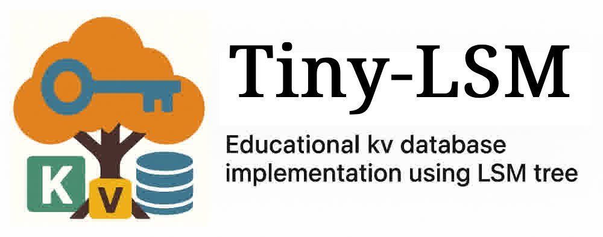

# Tiny-LSM-Go

<div align="center">
  
</div>

[](https://golang.org)
[](./LICENSE)


`Tiny-LSM-Go` is a Go implementation of a simple key-value database from scratch, using LSM-tree as the storage engine. This project is a port of the original [tiny-lsm](https://github.com/Vanilla-Beauty/tiny-lsm) C++ implementation, designed for educational purposes to help understand LSM-tree data structures and storage engine internals.

## ✨ Features

- **LSM-Tree Storage Engine**: Complete implementation with MemTable, SST files, and compaction
- **MVCC Transactions**: Multi-version concurrency control with configurable isolation levels
- **Write-Ahead Logging (WAL)**: Ensures data durability and crash recovery
- **Configurable Block Cache**: LRU-K cache implementation for better performance
- **Bloom Filters**: Reduces disk I/O for non-existent keys
- **Iterator Support**: Range queries and prefix scans
- **TOML Configuration**: Flexible configuration management

## 🏗️ Architecture

The project follows a layered architecture similar to LevelDB:

```
┌─────────────────────────────┐
│         LSM Engine          │
├─────────────────────────────┤
│      Transaction Layer      │
├─────────────────────────────┤
│    MemTable + WAL Layer     │
├─────────────────────────────┤
│      SST + Cache Layer      │
├─────────────────────────────┤
│      Storage Layer          │
└─────────────────────────────┘
```

### Core Components

- **SkipList**: In-memory data structure for MemTable
- **MemTable**: Active and frozen memory tables
- **SST (Sorted String Table)**: On-disk storage format
- **Block Cache**: Caches frequently accessed data blocks
- **WAL**: Write-ahead log for durability
- **Transaction Manager**: Handles MVCC and isolation levels
- **Compaction**: Background process to optimize storage

## 🚀 Quick Start

### Installation

```bash
git clone https://github.com/Vanilla-Beauty/tiny-lsm-go
cd tiny-lsm-go
go mod tidy
```

### Basic Usage

```go
package main

import (
    "fmt"
    "log"
    
    "tiny-lsm-go/pkg/lsm"
)

func main() {
    // Create LSM instance
    db, err := lsm.New("data")
    if err != nil {
        log.Fatal(err)
    }
    defer db.Close()

    // Put data
    err = db.Put("key1", "value1")
    if err != nil {
        log.Fatal(err)
    }

    // Get data
    value, found, err := db.Get("key1")
    if err != nil {
        log.Fatal(err)
    }
    if found {
        fmt.Printf("key1: %s\n", value)
    }

    // Delete data
    err = db.Delete("key1")
    if err != nil {
        log.Fatal(err)
    }

    // Range iteration
    iter := db.NewIterator()
    defer iter.Close()
    
    for iter.SeekToFirst(); iter.Valid(); iter.Next() {
        fmt.Printf("%s: %s\n", iter.Key(), iter.Value())
    }

    // Transaction example
    txn := db.NewTransaction()
    defer txn.Rollback()

    txn.Put("tx_key", "tx_value")
    value, found, err = txn.Get("tx_key")
    if err != nil {
        log.Fatal(err)
    }
    
    err = txn.Commit()
    if err != nil {
        log.Fatal(err)
    }
}
```

## 📖 Documentation

### Configuration

The system uses TOML configuration files. See `config.toml` for available options:

```toml
[lsm.core]
LSM_TOL_MEM_SIZE_LIMIT = 67108864    # 64MB total memory limit
LSM_PER_MEM_SIZE_LIMIT = 4194304     # 4MB per MemTable
LSM_BLOCK_SIZE = 32768               # 32KB block size
LSM_SST_LEVEL_RATIO = 4              # Level size ratio

[lsm.cache]
LSM_BLOCK_CACHE_CAPACITY = 1024      # Block cache capacity
LSM_BLOCK_CACHE_K = 8                # LRU-K parameter

[bloom_filter]
BLOOM_FILTER_EXPECTED_SIZE = 65536
BLOOM_FILTER_EXPECTED_ERROR_RATE = 0.1
```

## 🧪 Testing

Run the test suite:

```bash
go test ./...
```

Run benchmarks:

```bash
go test -bench=. ./...
```

## 🤝 Contributing

This is an educational project. Contributions are welcome! Please feel free to submit issues and pull requests.

## 📚 References
- [Original Tiny-LSM C++ Implementation](https://github.com/Vanilla-Beauty/tiny-lsm)
- [Mini-LSM Tutorial](https://skyzh.github.io/mini-lsm/)
- [LevelDB](https://github.com/google/leveldb)

## 📜 License

This project is licensed under the MIT License - see the [LICENSE](LICENSE) file for details.
