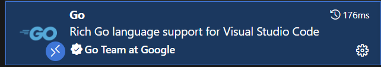

# Lab 0 环境准备
# 1 OS和编译器环境
本实现使用的`Go`版本在`1.21`及其以上都可以正常使用。

> 我使用`WSL2`的`kali linux`作为开发环境, `WSL2`相关内容可以参考[WSL入门到入土](https://zhuanlan.zhihu.com/p/682583573)
> 经个人验证, `WSL2`的`kali-linux`和`Ubuntu 22.04`均能正常完成本实验

## 1.1 Golang安装
如果你没有安装`Golang`或者版本较低, 直接在官方网站进行安装即可 https://go.dev/dl/

## 1.2 代理设置
官方的镜像库是国外地址, 如果你不开代理, 有点依赖可能无法拉去, 建议使用国内的七牛云作为镜像源:
```bash
go env -w https://goproxy.cn
```

# 2 VSCode配置
## 2.1 插件安装
`VScode`可以通过安装`Go`的插件支持语法高亮、智能跳转等功能,:



## 2.2 gopls安装（第一步如果报错）
·就是Go团队为Go语言开发的官方语言服务器。它在后台持续运行，对代码进行分析，并将分析结果通过LSP提供给VSCode。`VSCode`的官方`Go`插件会自动安装`gopls`, 但有时候可能会失败, 这时我们可以手动安装:
```bash
go install golang.org/x/tools/gopls@latest
```
如果有报错, 大概率是你的代理设置有问题, 重新设置代理后再次尝试即可。

常见的报错就是`golang`的版本与`gopls`版本不匹配, 这时可以指定版本, 安装, 具体的版本信息可以从`Github`查看: https://github.com/golang/tools/blob/master/gopls/doc/index.md, 例如官网查询`Golang 1.20`的`gopls`版本为`v0.15.3`, 那么我们就可以安装:
```bash
go install golang.org/x/tools/gopls@v0.15.3
```

## 2.3 delve安装(Optional)
`delve`是`Go`语言的调试工具, 你可以把它看做`Go`版本的`gdb`, 通过它可以在`VSCode`中进行断点调试, 安装也很简单
```bash
go install github.com/go-delve/delve/cmd/dlv@latest
```
具体使用方法可以参考[Getting Started](https://github.com/go-delve/delve/blob/master/Documentation/cli/getting_started.md)

## 2.4 其他实用插件
### 2.4.1 Better Comments && TodoTree
`Better Comments`是一个`VSCode`插件, 它可以提供代码注释高亮和语法高亮功能, 使得代码更加易读。比如像`TODO`, `!`这样的符号:


当我们实现一个功能但其后续需要更新时, 我们可以在代码中添加`TODO`注释, 以便后续更新时更醒目。

`TodoTree`则会在侧边栏展开我们标记了`TODO`的注释的位置


### 2.4.2 AI插件
如果你有钱, 直接用`Cusor`, `Windsurf`, 他们的体验更好

如果和我一样不够钱, 那么你可以使用`通义灵码`, `Cline`或者`GitHub Copilot`:


# 3 Lab代码仓库说明
按照下面的命令拉取实验代码仓库:
```bash
git clone https://github.com/Vanilla-Beauty/tiny-lsm-go.git --depth 1 -b lab
git checkout -b your-branch
```

建议你自行创建一个分支, 避免对主仓库的修改, 同时每次实验前与远程`lab`分支同步:
```bash
git merge origin/lab # 如果你fork后, origin替换为本仓库的名字
```

如果你之前的环境配置没有问题的话, 编译项目能够正常进行:
```bash
cd tiny-lsm-go
go mod tidy
go test -v ./... # 你现在还没有开始lab, 因此这里肯定是会报错的
```

### 项目目录结构

```bash
.
├── example/              # 使用示例代码
├── pkg/                  # 核心功能包
│   ├── block/            # 数据块处理模块
│   ├── cache/            # 缓存模块
│   ├── common/           # 通用数据结构
│   ├── config/           # 配置管理模块
│   ├── iterator/         # 迭代器模块
│   ├── logger/           # 日志模块
│   ├── lsm/              # LSM-tree核心实现
│   ├── memtable/         # 内存表模块
│   ├── redis/            # Redis兼容接口
│   ├── skiplist/         # 跳表实现
│   ├── sst/              # SST文件处理模块
│   ├── utils/            # 工具函数模块
│   └── wal/              # 写前日志模块
├── server/               # 服务端实现
├── tool/                 # 调试和分析工具
├── README.md
└── config.toml          # 配置文件
```

